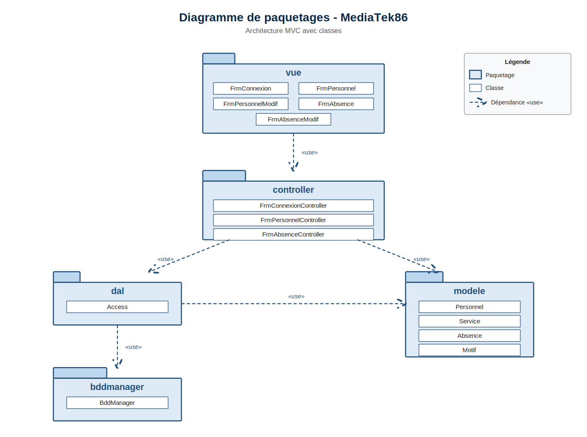
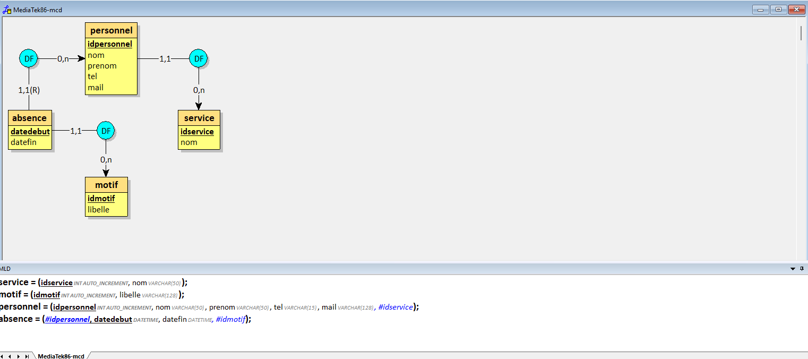
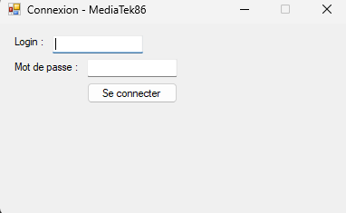
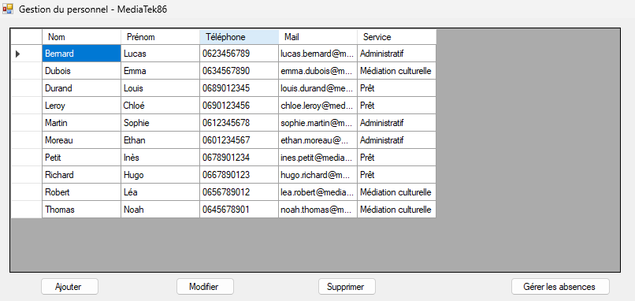
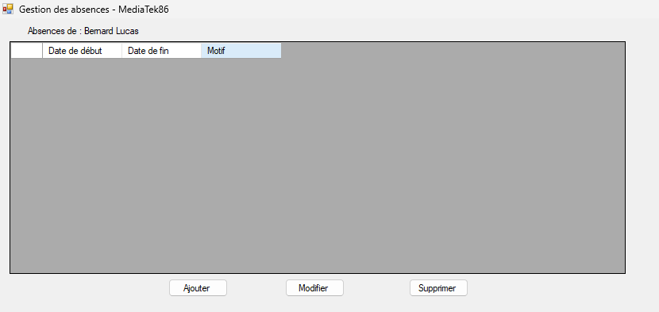

# MediaTek86 - Application de gestion du personnel

## Présentation

Application de bureau développée pour le réseau **MediaTek86**, qui gère les médiathèques du département de la Vienne.  
Cette application permet de gérer le personnel de chaque médiathèque, leur affectation à un service et leurs absences.

Développée dans le cadre d'un atelier de professionnalisation pour le compte de l'ESN **InfoTech Services 86**.

## Technologies utilisées

- **Langage** : C#
- **Framework** : .NET Framework 4.7.2
- **IDE** : Visual Studio 2022
- **Interface** : Windows Forms
- **Base de données** : MySQL (via WampServer)
- **Architecture** : MVC (Modèle-Vue-Contrôleur)
- **Versioning** : Git / GitHub
- **Documentation** : SandCastle Help File Builder

## Architecture du projet

L'application est structurée selon le modèle MVC :
MediaTek86/
├── bddmanager/      -> Classe technique singleton de connexion à la BDD
├── dal/             -> Couche d'accès aux données (Data Access Layer)
├── modele/          -> Classes métier (Personnel, Service, Motif, Absence)
├── controller/      -> Contrôleurs (logique applicative)
└── vue/             -> Formulaires Windows Forms
### Diagramme de paquetages

## Base de données

### Schéma conceptuel (MCD)

La base de données contient 5 tables :
- `responsable` : login et mot de passe du responsable (hashé SHA2-256)
- `service` : services des médiathèques (administratif, médiation culturelle, prêt)
- `motif` : motifs d'absence (vacances, maladie, motif familial, congé parental)
- `personnel` : informations des agents (nom, prénom, téléphone, mail, service)
- `absence` : absences des agents (dates et motif)

### Identifiants par défaut

**Utilisateur MySQL** :
- Login : `mediatek86_user`
- Mot de passe : `Mediatek2024!`

**Responsable de l'application** :
- Login : `admin`
- Mot de passe : `Admin2024!`

## Fonctionnalités

### Connexion sécurisée
- Authentification du responsable par login/mot de passe
- Hashage du mot de passe en SHA2-256

### Gestion du personnel
- Affichage de la liste du personnel
- Ajout d'un nouvel agent
- Modification d'un agent existant
- Suppression d'un agent (avec confirmation)

### Gestion des absences
- Affichage des absences d'un agent (triées par date décroissante)
- Ajout d'une absence
- Modification d'une absence (avec confirmation)
- Suppression d'une absence (avec confirmation)
- Validation des dates (date de fin postérieure à la date de début)
- Détection de chevauchement avec une absence existante

## Aperçu des interfaces

### Connexion

### Gestion du personnel

### Gestion des absences

## Installation

### Prérequis
- Windows 10 ou 11
- WampServer installé et lancé
- Base de données MediaTek86 importée (voir script SQL fourni)

### Procédure d'installation

1. Télécharger le fichier `MediaTek86Setup.msi`
2. Lancer l'installateur et suivre l'assistant
3. L'application se trouve dans le menu Démarrer ou via le raccourci sur le bureau
4. Lancer WampServer (icône verte dans la barre des tâches)
5. Lancer l'application

## Structure du dépôt

- `MediaTek86/` : Code source de l'application
- `MediaTek86Setup/` : Projet d'installation MSI
- `Documentation.zip` : Documentation technique générée avec SandCastle
- `captures/` : Captures d'écran (MCD, interfaces, diagramme de paquetages)

## Détail des commits

| Date | Commit | Description |
|---|---|---|
| Semaine 1 | Ajouter .gitattributes, .gitignore et README.md | Initialisation du dépôt |
|Semaine 1 | feat: création de la structure MVC et visuel des interfaces | Étape 2 - Création des packages MVC et interfaces |
| Semaine 1| feat: création BddManager, DAL et classes métier | Étape 3 - Couches techniques et métier |
| Semaine 2| docs: ajout commentaires XML et génération documentation technique | Étape 3 - Documentation XML |
| Semaine 2 | docs: génération documentation technique avec SandCastle | Étape 3 - Documentation HTML |
| Semaine 3 | feat: connexion sécurisée avec SHA2-256 | Étape 4 - Authentification |
| Semaine 3 | feat: affichage de la liste du personnel | Étape 4 - Affichage personnel |
| Semaine 4 | feat: CRUD complet du personnel | Étape 4 - Gestion personnel |
| Semaine 4 | feat: CRUD complet des absences | Étape 4 - Gestion absences |
| Semaine 4 | feat: validation des dates et anti-chevauchement des absences | Étape 4 - Validations métier |
| Semaine 4 | feat: création de l'installateur MSI | Étape 6 - Déploiement |

## Auteur

Développeur : **Mimoun Chaouchi**  
Pour : ESN InfoTech Services 86  
Contexte : Atelier de professionnalisation - BTS SIO SLAM

## Licence

Projet académique réalisé dans le cadre d'un atelier de formation.